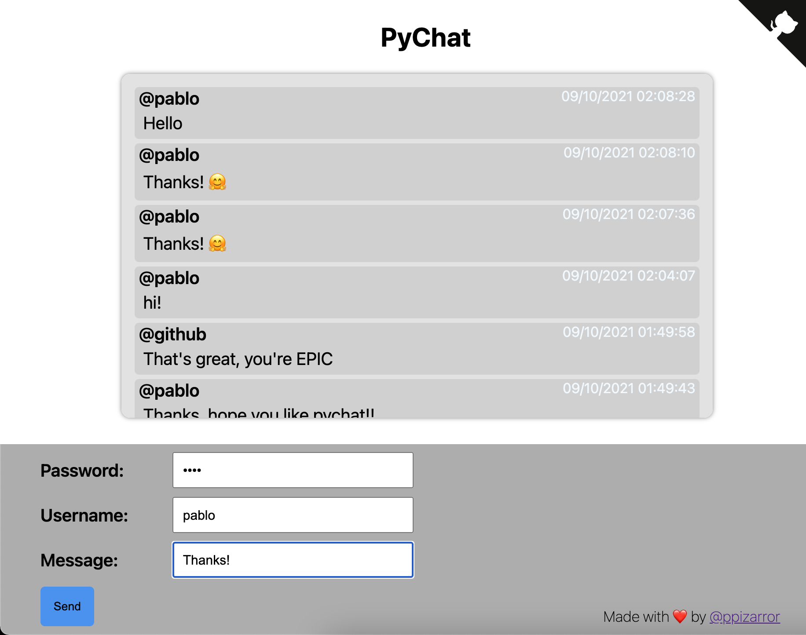

# pychat

Academic example of a chat implemented in python cgi + js.

## Run

To run the server, just execute the following command:

```bash
python3 -m http.server --bind localhost --cgi 9999
```

You also required to serve SQL. The database can be configured in *cgi-bin/db.py*, just write the
database, user, and password. The repo already contains a pychat.sql file to create your own tables.

## Execute

Write and Read your chats! For such aim, a password must be defined to access the messages. The chat
only will retrieve all the messages for the same password.

| Field | Type | Length |
| :-: | :-: | :--: |
| Password | str | 4-32 |
| Username | str | 4-10 |
| Message | str | 1-256 |



## License

This project is licensed under MIT [https://opensource.org/licenses/MIT/]

## Author

[Pablo Pizarro R.](https://ppizarror.com) | 2020 - 2021
